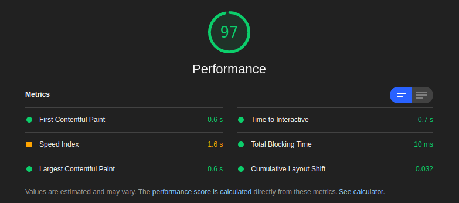

# SQL Editor
A SQL editor view where users can query easily on a table using SQL, and see the results.

## Performance


### Steps performed to improve performance
1. Used webpack bundle analyzer to anlyze the build.
2. According to analyzer element-plus package contributed most to the size of vendor file (400 KiB).
3. Then moved the global imports of element-plus components that were only used once to there respesting components.
4. This reduced the size of vendor file to 316 KiB.
5. Then applied lazy loading to Navbar component, which slit the vendor file and new size of vendor file become 244 KiB.
6. This whole process doesn't changed the overall size of build, it improved the performance by only loading the chunk when required.

## Folder Structure
```
.
├── db ⇒ act as database for project
├── pictures
├── public
│   ├── _redirects ⇒ redirect config for netlify
│   └── index.html
├── src
│   ├── assets
│   ├── components
│   │   ├── Icon.vue
│   │   ├── Navbar.vue
│   │   ├── QueryResult.vue
│   │   ├── SaveIcon.vue
│   │   ├── SideNav.vue
│   │   ├── SQLIcon.vue
│   │   ├── Tabbar.vue
│   │   └── TableIcon.vue
│   ├── plugins
│   │   └── element.js
│   ├── router
│   │   └── index.js
│   ├── utils
│   │   ├── auth.js
│   │   └── index.js
│   ├── views
│   │   ├── Dashboard.vue
│   │   ├── Editor.vue
│   │   ├── Home.vue
│   │   ├── Login.vue
│   │   └── NotFound.vue
│   ├── App.vue
│   ├── fakexios.js ⇒ to simulate api calls
│   └── main.js
├── .browserlistrc
├── .gitignore
├── babel.config.js
├── jsconfig.json
├── LICENSE
├── package.json
├── README.md
└── yarn.lock
```

## Project 

## Project setup
```
yarn install
```

### Compiles and hot-reloads for development
```
yarn serve
```

### Compiles and minifies for production
```
yarn build
```
